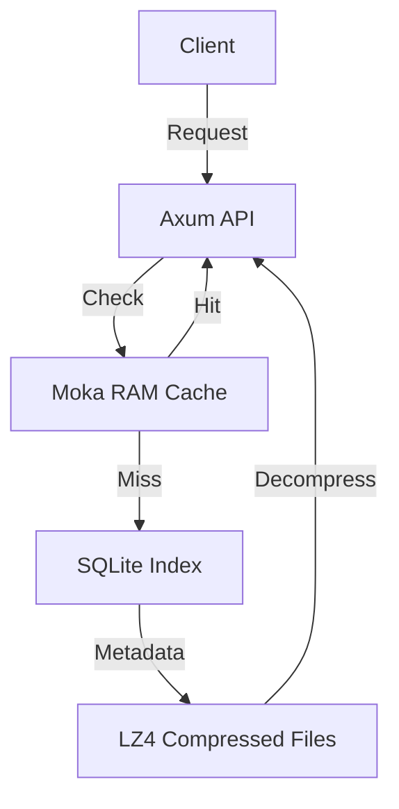

# TulparAPI

[](https://github.com/aeTunga/TulparAPI/actions/workflows/rust.yml)

TulparAPI is a high-performance, read-optimized backend API boilerplate built with Rust and Axum. It utilizes a hybrid storage architecture designed to serve static, text-heavy content (such as books, archives, or large datasets) with minimal latency and reduced database overhead.

This project prioritizes speed and efficiency by offloading heavy content from the primary database into compressed file storage, using the database solely for lightweight metadata indexing.

## Architecture

TulparAPI implements a three-layer data access strategy to ensure optimal performance:



### Layer 1: Memory Cache (Moka)
Frequently accessed data is served directly from RAM using an asynchronous LRU (Least Recently Used) cache. This results in sub-millisecond response times for hot data, bypassing disk I/O entirely.

### Layer 2: SQLite Metadata Index
The SQLite database serves as a lightweight index. It stores only essential metadata such as the collection ID (alias), display name, and the relative path to the content file. This keeps the database size manageable and queries fast.

### Layer 3: Compressed File Storage (LZ4)
The actual content (e.g., large JSON structures) is stored in the filesystem as highly compressed `.lz4` files. This approach:
- Reduces disk space usage significantly.
- Leverages operating system file system caching.
- Decouples content size from database performance.

## Technology Stack

- **Language:** Rust (Latest Stable)
- **Web Framework:** Axum 0.7
- **Asynchronous Runtime:** Tokio
- **Database:** SQLx with SQLite
- **Serialization:** Serde & Serde JSON
- **Compression:** lz4_flex
- **Caching:** Moka
- **Logging & Tracing:** Tracing

## Project Structure

```text
├── data/               # Raw JSON data sources (development reference)
├── migrations/         # SQLx database migration files
├── src/
│   ├── bin/            # Utility binaries (e.g., data compression tools)
│   ├── modules/
│   │   └── content/    # Core domain logic and storage implementation
│   ├── config.rs       # Application configuration management
│   ├── db.rs           # Database connection and initialization
│   ├── lib.rs          # Application state and router configuration
│   └── main.rs         # Application entry point
└── storage/            # Runtime directory for compressed .lz4 content
```

## Getting Started

### Prerequisites

Ensure you have the following installed on your system:
- Rust and Cargo (latest stable version)
- SQLite3

### Installation

1. Clone the repository:
   ```bash
   git clone github.com/aeTunga/TulparAPI
   cd TulparAPI
   ```

2. Create a `.env` file in the root directory:
   ```env
   DATABASE_URL=sqlite:data.db
   RUST_LOG=tulpar_api=debug,tower_http=debug
   STORAGE_PATH=storage
   PORT=3000
   ```

3. Initialize the database and run migrations:
   ```bash
   # Create the database file
   touch data.db

    # Run SQLx migrations
    # Note: If you don't have sqlx-cli, you can use sqlite3 directly as shown below
    sqlite3 data.db < migrations/20240101000000_init.sql
    ```

### Data Management

TulparAPI requires content to be compressed into the LZ4 format before it can be served. A dedicated seeding tool is provided to handle compression and database registration in one step.

#### Seeding Data

To seed a collection (like the included Rubaiyat demo):

```bash
cargo run --bin seed -- data/rubaiyat.json rubaiyat "Rubaiyat of Omar Khayyam" en
```

This command will:
1. Read the input JSON.
2. Compress it into `storage/collections/rubaiyat.json.lz4`.
3. Create/Update the metadata in the SQLite database with the provided alias, name, and language.

#### Compressing Custom Data (Manual)

If you only need to compress files without database registration:

```bash
cargo run --bin compress -- <input_file.json> <output_file.json.lz4>
```

## Testing

The project includes a comprehensive integration test suite that covers the full API flow, database persistence, LZ4 decompression, and middleware.

Run the tests:
```bash
cargo test --test integration_test
```

## Observability & Security

- **Request IDs**: Every request is assigned a unique UUID via the `x-request-id` header, which is propagated through response headers and included in logs.
- **Rate Limiting**: IP-based rate limiting is enabled (2 requests/sec, burst of 5) to protect the API.
- **Tracing**: Structured logging is implemented using the `tracing` crate.
- **CI/CD**: GitHub Actions workflow is configured in `.github/workflows/rust.yml` to run tests on every push.

## Running the Application

Start the server in development mode:

```bash
cargo run
```

The server will start on the port specified in your `.env` file (default: 3000).

## Documentation

For detailed information on available endpoints, request formats, and response examples, please refer to [API.md](API.md).

## License

This project is licensed under the MIT License.
